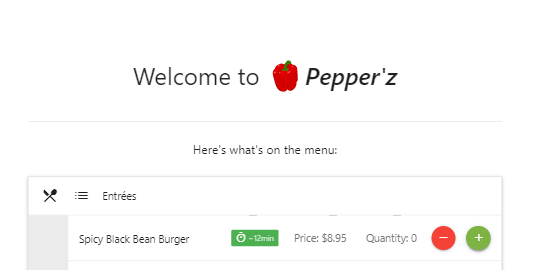

# OrderUp
A React app for ordering food inside a restaurant.  

## Table of Contents
- [Usage](#Usage)
- [Features](#Features)
- [Contributors](#Contributors)
- [Dependencies](#Dependencies)
## Usage
Intended for restaurants to display on tablet computers near the physical entrance. Restaurants can login to edit menus and manage orders, or open the customer entry point and stage the tablet for use.
## Features
- Coming soon

## Contributors
<a href="https://github.com/mgrinx">mgrinx</a>   

## Dependencies

